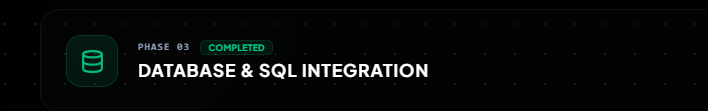

# Pankaj Patel - Personal Portfolio Website 🚀

[](https://github.com/PankajjPatel/Portfolio_Pankaj/stargazers)
[](https://github.com/PankajjPatel/Portfolio_Pankaj/network/members)
[](https://react.dev)
[](https://djangoproject.com)

> **Tagline:** Showcasing digital craftsmanship, full-stack solutions, and modern web applications.

This repository contains the complete codebase for my **Personal Portfolio Website**, designed to highlight my skills, projects, certifications, and experience. It is a full-stack application featuring a React-based interactive frontend and a Django-based REST API backend that manages contact form submissions.

--- 

## 🛠️ Tech Stack & Architecture

### Frontend
- **Framework & Build Tool:** React 19 (via Vite) & TypeScript
- **Styling:** Tailwind CSS v4 (offering high performance and native CSS-based customization)
- **Animations:** Framer Motion (delivering smooth page transitions and micro-interactions)
- **Icons:** Lucide React
- **API Client:** Axios (for connecting with the Django backend)

### Backend
- **Framework:** Python & Django 6.0+
- **API Engine:** Django REST Framework (DRF)
- **CORS Management:** Django CORS Headers
- **Environment Handling:** django-environ
- **Database:** SQLite (default for local development) / support for MySQL
- **WSGI Server:** Gunicorn (production ready)


---hi

## 📂 Project Architecture Layout

```
Portfolio/
├── backend/                  # Django REST API Backend
│   ├── contact/              # App managing visitor messages & models
│   │   ├── models.py         # ContactMessage schema (name, email, subject, message)
│   │   └── views.py          # API endpoints for form submissions
│   ├── portfolio_backend/    # Settings & core routing files
│   │   ├── settings.py       # Django global settings
│   │   └── urls.py           # Main routing entrypoint
│   ├── requirements.txt      # Backend Python dependencies
│   └── manage.py             # Django CLI manager
│
└── frontend/                 # Vite + React + TypeScript Frontend
    ├── src/                  # React components & pages
    │   ├── sections/         # Portfolio UI sections (Hero, About, Services, Projects, Certifications, Contact)
    │   ├── App.tsx           # Layout assembler
    │   └── main.tsx          # App entry point
    ├── package.json          # Node dependencies & scripts
    └── vite.config.ts        # Vite build configurations
```

---

## 🚀 Step-by-Step Local Setup Guide

Follow these steps to run the complete stack locally:

### 1. Backend Setup (Django)
1. Navigate to the backend directory:
   ```bash
   cd backend
   ```
2. Create and activate a Python virtual environment:
   ```bash
   python -m venv venv
   # On Windows (cmd/powershell):
   .\venv\Scripts\activate
   # On macOS/Linux:
   source venv/bin/activate
   ```
3. Install dependencies:
   ```bash
   pip install -r requirements.txt
   ```
4. Copy env variables template and configure (if needed):
   ```bash
   cp .env.example .env
   ```
5. Apply database migrations:
   ```bash
   python manage.py makemigrations
   python manage.py migrate
   ```
6. Run the backend development server:
   ```bash
   python manage.py runserver
   ```
   The API will be available at `http://127.0.0.1:8000/`.

---

### 2. Frontend Setup (React + Vite)
1. Open a new terminal inside the root directory and navigate to `frontend`:
   ```bash
   cd frontend
   ```
2. Install npm packages:
   ```bash
   npm install
   ```
3. Start the Vite development server:
   ```bash
   npm run dev
   ```
   Open your browser and navigate to the local URL (usually `http://localhost:5173`).

---

## 📬 Contact Form API integration
The portfolio features a contact form that enables users to write messages directly to me. 
- Endpoint: `/api/contact/`
- Method: `POST`
- Payload:
  ```json
  {
    "name": "Visitor Name",
    "email": "visitor@example.com",
    "subject": "Inquiry",
    "message": "Message content"
  }
  ```

  

- Saved data can be managed through the Django Admin panel at `http://127.0.0.1:8000/admin`.

